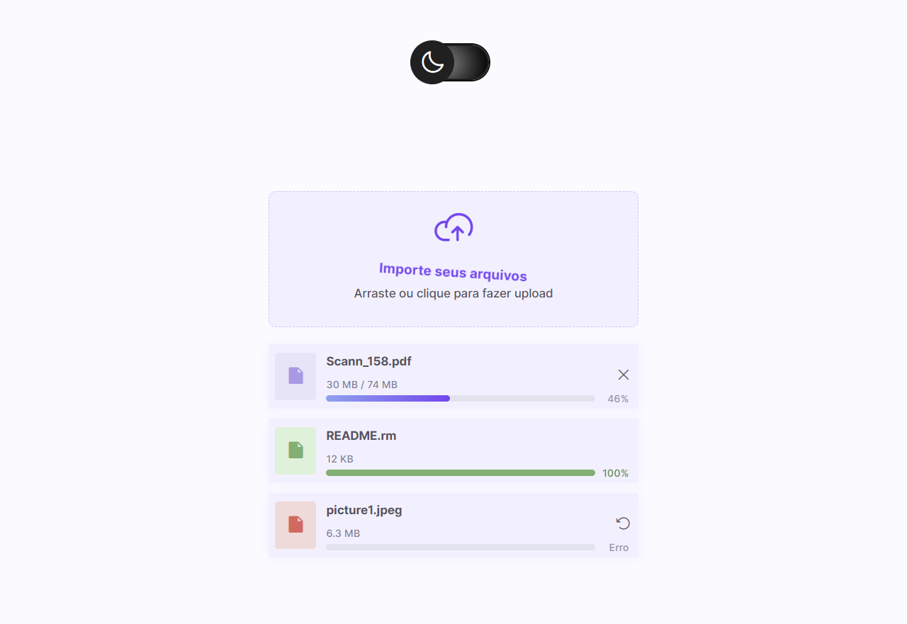
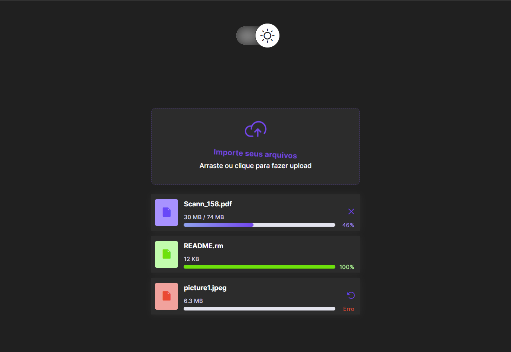
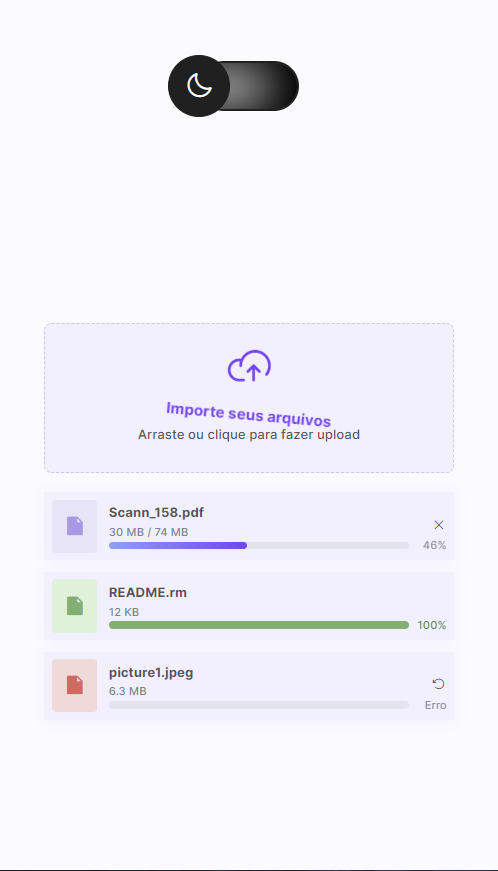
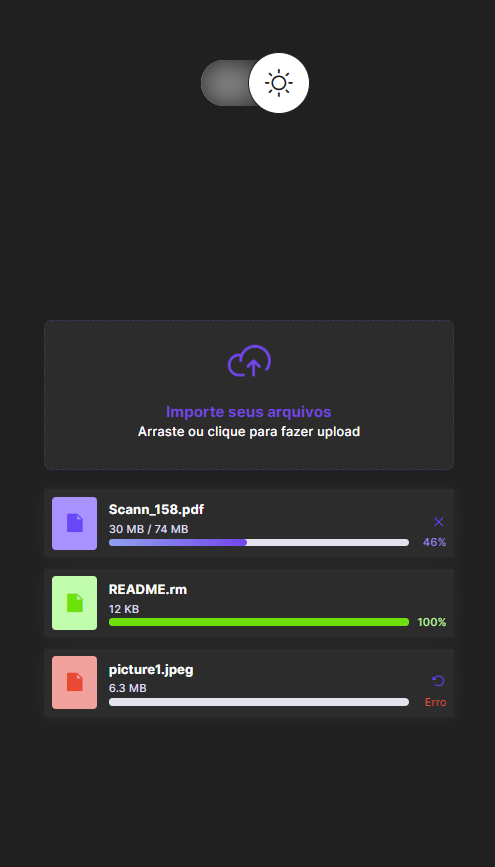

<h1 align="center">upload-component</h1>

[PC Version](#pc-version) | [Mobile Version](#mobile-version) | [Techs](#techs) | [Library](#library) | [To Access](https://kaiquecamposdev.github.io/upload-component/)

## 💻 PC Version  

## 📱 Mobile Version 

  
  

### 🚀 Techs 

- Figma
- HTML5
- CSS3
- JavaScript

### 📚 Library 

- DOM
- [Phosphor Icons](https://phosphoricons.com/)

Thank you for attention <3

